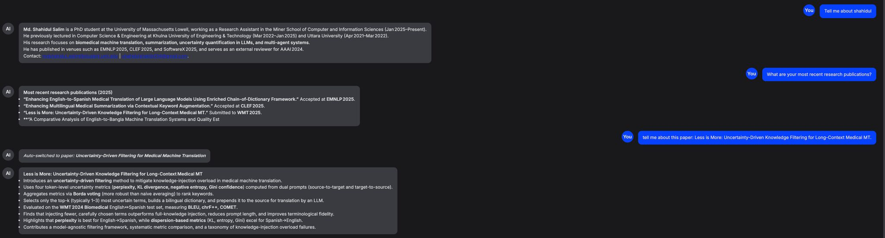

# AI-Powered Personal & Academic Portfolio Assistant

🚀 **Personal AI Assistant** — A chatbot built with **gpt-oss-20B** and **llama.cpp/vLLM**, deployed as a **static website on GitHub Pages**.
It allows users to explore my academic background and research papers through **natural conversations**.

🔗 **Live Demo**: [AI Assistant](https://shahidul034.github.io/My-portfolio-website/chatbot_main/chatbot.html)

---

## 📸 Preview

  

---

## ✨ Features

* **Personal Profile Chat** → Loads info from `context.txt`
* **Research Paper Auto-Switching** → Uses `papersV2.json` (metadata) + `paper_text/` (full texts)
* **Sidebar Controls** → Adjust temperature, max tokens, and context source
* **Modern UI** → Clean CSS, responsive, mobile-friendly
* **Lightweight** → Static frontend, only needs your LLM API endpoint

---

## 📂 Project Structure

```
chatbot_main/
│── index.html          # Chatbot UI
│── chatbotV2.js          # Full chatbot logic
│── chatbot.js            # Old/alternate script
│── modern-chatbot.css    # Styles
│── context.txt           # Personal info context
│── papersV2.json         # Paper metadata (titles, IDs, etc.)
│── paper_text/           # Full text of each paper (referenced by papersV2.json)
│── README.md             # Documentation
│── .gitattributes
│── .git/                 # Git version control
```

---

## 🚀 Getting Started

### 1. Clone this repository

```bash
git clone https://github.com/shahidul034/My-portfolio-website.git
cd My-portfolio-website/chatbot_main
```

### 2. Download the model

Get **gpt-oss-20B** from Hugging Face:
👉 [unsloth/gpt-oss collection](https://huggingface.co/collections/unsloth/gpt-oss-6892433695ce0dee42f31681)

Example (with `git-lfs`):

```bash
git lfs install
git clone https://huggingface.co/unsloth/gpt-oss-20b
```

---

### 3. Run the model locally (llama.cpp server)

Example command (adjust path + GPU ID):

```bash
CUDA_VISIBLE_DEVICES=4 ~/llama.cpp/build/bin/llama-server \
    -m /home/mshahidul/model/gpt20b/gpt-oss-20b-F16.gguf \
    --host 0.0.0.0 --port 8080 \
    --jinja -ngl 80 --threads -1 --ctx-size 16384 \
    --temp 0.7 --top-p 0.9 --top-k 50
```

This will expose an **OpenAI-compatible API** at:

```
http://localhost:8080/v1/chat/completions
```

---

### 4. Expose API with ngrok (for GitHub Pages)

If you want to use the chatbot online (e.g., from your GitHub Pages site), run:

```bash
ngrok http --domain="your-domain-name" 8080
```

This will give you a **public HTTPS endpoint**.

---

### 5. Configure API endpoint

In `chatbotV2.js`, set your API endpoint:

```js
const API_URL = "https://your-ngrok-domain.ngrok-free.app/v1/chat/completions";
```

---

### 6. Run locally or deploy

* Local test:


Open → [http://localhost:8080/index.html](http://localhost:8080/index.html)

* Deploy: Push to GitHub → Enable **Pages** → Open chatbot at:

```
https://<username>.github.io/<repo>/chatbot_main/index.html
```

---

## 📖 Example Queries

* "Who is Shahidul?"
* "Summarize the paper *Less is More: Uncertainty-Driven Knowledge Filtering*."
* "What are your research interests?"
* "Tell me about your teaching experience."

---

## 📌 Roadmap

* [ ] Add **paper search**
* [ ] Streaming responses
* [ ] Integrate **projects & datasets**
* [ ] Option to upload CV/resume for Q\&A

---

## 📜 License

MIT License

---

